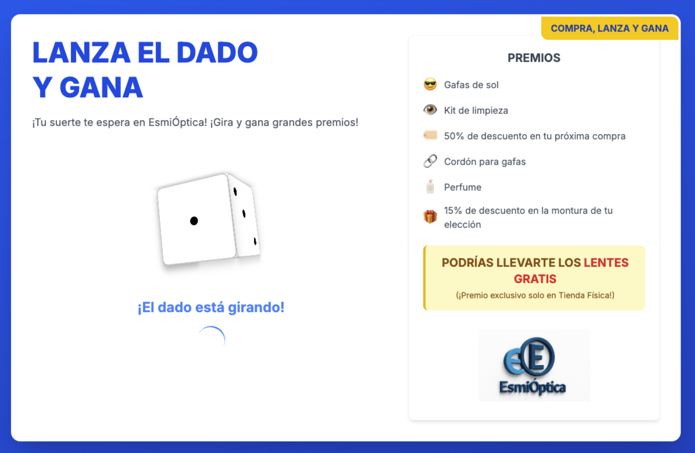
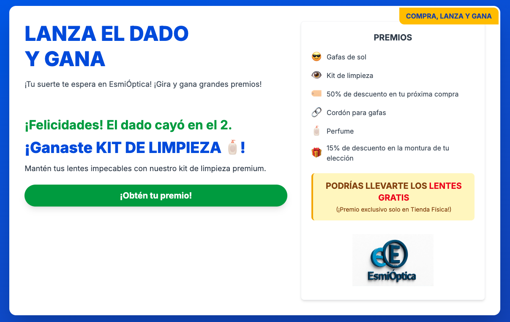

# EsMiOptica Dados

Juego de Dados para promociones de EsMiOptica.






## Cómo ejecutar en local

Sigue estos pasos para ejecutar la aplicación en tu entorno de desarrollo local:

1.  **Navegar al directorio del proyecto:**
    Si ya tienes el código fuente, asegúrate de estar en el directorio raíz del proyecto (`esmioptica-dados`) en tu terminal.
    Si no tienes el código fuente, primero clona el repositorio:
    ```bash
    git clone https://github.com/otobonh/esmioptica-dados.git
    cd esmioptica-dados
    ```

2.  **Instalar dependencias:**
    Una vez en el directorio raíz del proyecto, instala las dependencias necesarias ejecutando:
    ```bash
    npm install
    ```

3.  **Ejecutar la aplicación:**
    Para iniciar el servidor de desarrollo, ejecuta:
    ```bash
    npm run dev
    ```

4.  **Abrir en el navegador:**
    La terminal te indicará la URL donde la aplicación está corriendo (usualmente `http://localhost:5173` o un puerto similar). Abre esta URL en tu navegador web.
    La aplicación se actualizará automáticamente en el navegador cada vez que guardes cambios en los archivos fuente gracias a HMR (Hot Module Replacement) de Vite.

¡Disfruta desarrollando!

## Cómo compilar para producción

1. **Configurar Firebase:**
    Sigue los pasos de la [documentación de Firebase](./README_FIREBASE_DATABASE.md) para configurar tu proyecto.

2. **Configurar la base de datos:**
    Copia el archivo `env.example` a `.env` y configura las variables de entorno.

3. **Compilar la aplicación:**
    Una vez en el directorio raíz del proyecto, compila la aplicación ejecutando:
    ```bash
    npm run build
    ```

4. **Subir la aplicación a Firebase:**
    Sube la aplicación a Firebase ejecutando:
    ```bash
    npm run deploy
    ```

## Como hacer el plug-in para Wordpress

1. **Configurar Firebase:**
    Sigue los pasos de la [documentación de Firebase](./README_FIREBASE_DATABASE.md) para configurar tu proyecto.

2. **Configurar la base de datos:**
    Copia el archivo `env.example` a `.env` y configura las variables de entorno.
    
3. **Desarrollar el plug-in:**
    Sigue los pasos de la [documentación de Wordpress](./README_WORDPRESS_PLUGIN.md) para configurar tu proyecto.
